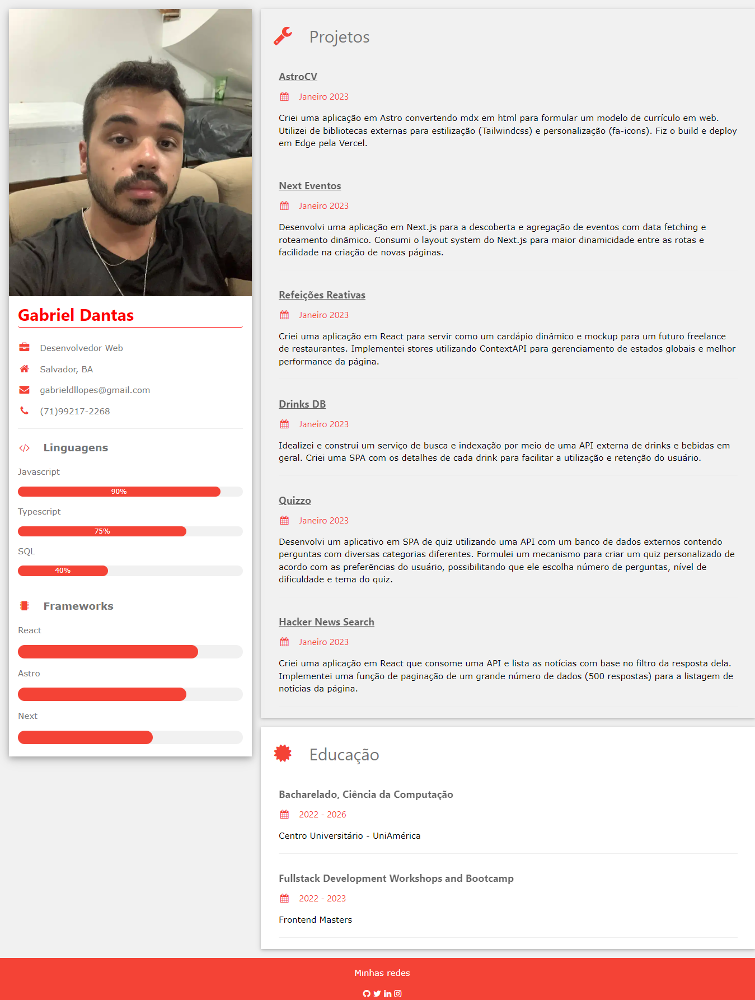

# AstroCV - Curriculum Vitae

## Descrição

Este é meu primeiro projeto utilizando Astro para gerar uma página simples e responsiva.

Tentei me ater à praticidade, sem mergulhar muito fundo no design, e focando no repasse de informações, pois o objetivo é também divulgar meu currículo como Desenvolvedor.

## Detalhes

● Criei uma aplicação em Astro convertendo mdx em html para formular um modelo de currículo em web.

● Utilizei de bibliotecas externas para estilização (Tailwindcss) e personalização (fa-icons).

● Fiz o build e deploy em Edge pela Vercel.

## Link para acesso
- https://astro-cv-ten.vercel.app/

## Prévia
